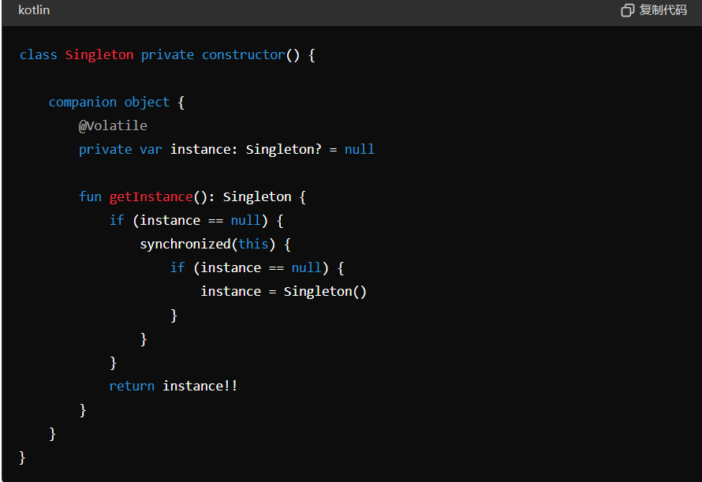

## view事件分发的过程：

事件从顶层View开始，通过dispatchTouchEvent传递。
ViewGroup可以通过onInterceptTouchEvent选择是否拦截事件。
如果事件没有被拦截，则传递给子View的dispatchTouchEvent。
最终由onTouchEvent处理事件。

### 1.dispatchTouchEvent:
这是事件分发的入口点。ViewGroup会先调用这个方法。
如果onInterceptTouchEvent返回true，事件会传递给当前View的onTouchEvent处理。
如果返回false，事件会继续传递给子View。

### 2.onInterceptTouchEvent:
只有ViewGroup需要实现此方法。
用于判断是否拦截事件。如果返回true，事件将交给自身的onTouchEvent处理；如果返回false，事件会传递给子View的dispatchTouchEvent。

### 3.onTouchEvent:
处理具体的触摸事件（如ACTION_DOWN、ACTION_MOVE、ACTION_UP等）。
返回true表示事件被消费，返回false表示事件未被消费，会继续向上传递。

---

## Activity的异常情况
**onSaveInstanceState，onRestoreInstanceState函数：**
**调用时机**:Activity即将被销毁并有机会重新显示的时候（屏幕旋转，内存资源不足导致销毁）调用，正常销毁Activity是不会调用的。

onSaveInstanceState保存数据，onRestoreInstanceState恢复数据。

outState 参数作用 :
数据保存 : Activity 生命周期结束的时候, 需要保存 Activity 状态的时候, 会将要保存的数据使用键值对的形式 保存在 Bundle 对象中;
恢复数据 : 在 Activity 的 onCreate()方法 创建 Activity 的时候会传入一个 Bundle 对象, 这个 Bundle 对象就是这个 outState 参数;

**onConfigurationChanged函数:**
在指定了configChanges为orientation后，Activity不会重新创建，会调用onConfigurationChanged而非上述2个函数。

---

## view绘制的流程
**测量阶段（Measure）:**
调用measure()方法，启动测量过程。
调用onMeasure()方法，计算View的宽高。
父View传递尺寸限制给子View，子View根据限制进行测量。

**布局阶段（Layout）:**
调用layout()方法，确定View的位置。
调用onLayout()方法，为每个子View指定位置和大小。
父View根据测量结果，设置子View的布局参数。

**绘制阶段（Draw）:**
调用draw()方法，启动绘制过程。
依次调用onDraw()方法绘制内容。
通过Canvas绘制View，绘制顺序为背景、内容、子View、装饰。

---

## Eventbus实现原理
1. 事件订阅与注册
订阅者注册: 使用register()方法，EventBus扫描订阅者对象中带有@Subscribe注解的方法，并将它们存储在内部的数据结构中。
事件类型: 根据方法参数类型，建立事件类型和订阅者方法的映射。
2. 事件发布
发布事件: 使用post()方法，将事件传递给EventBus。
事件匹配: EventBus根据事件类型找到所有匹配的订阅者方法。
3. 事件分发
线程模式: 根据订阅方法上定义的线程模式（如MAIN、BACKGROUND、ASYNC等），在相应的线程中调用订阅方法。
调用订阅方法: 通过反射调用匹配的订阅者方法。
4. 订阅者解除注册
解除注册: 使用unregister()方法，EventBus移除该订阅者的所有订阅方法，避免内存泄漏。

---

## 单例模式
1. 饿汉式（Eager Initialization）
**实现原理：**
实例在类加载时创建，因此保证了线程安全。即使不使用该实例，内存中也会一直存在，占用资源。
**适用场景：**
系统启动时就需要使用，且占用资源不多。
 

1. 懒汉式（Lazy Initialization）
**实现原理：**
延迟加载,实例在第一次使用时创建，实现了懒加载。通过判断实例是否为空，决定是否创建。线程不安全,在多线程环境下可能会出现多个实例，因为多个线程可能同时通过null检查。
**适用场景：**
单线程环境，或者可以接受多实例的情况下。
 

1. 线程安全的懒汉式
**实现原理：**
通过在getInstance()方法上加同步锁，确保同一时间只有一个线程可以访问。保证了多线程环境下的线程安全。由于整个方法被锁定，导致每次获取实例时都需要进行同步，影响性能。
**synchronized：** 每个对象有一个监视器锁，synchronized使用该锁进行互斥访问，确保同一时间只有一个线程可以执行同步代码块或方法。
**适用场景：**
需要线程安全，但实例化开销较小或请求频率较低的情况。
 

1. 双重检查锁（Double-Checked Locking）
**实现原理：**
双重检查：在同步块外和内各检查一次实例是否为null，减少了不必要的同步。
高效线程安全：结合了懒加载和线程安全，并减少了同步开销。
**volatile关键字：** 保证对变量的修改对所有线程立即可见，避免编译器和CPU对代码进行重排序，确保代码执行顺序。线程对volatile变量的修改会立即刷新到主内存，其他线程读取时会获取最新值。
**适用场景：**
高并发环境，且需要延迟加载的情况下。
 

1. 静态内部类
**实现原理：**
外部类​​​​​​​加载时，并不需要立即加载静态内部类，静态内部类不被加载则不去初始化INSTANCE ，具备饿汉式单例模式优点的同时，又可延迟加载。
**适用场景：**
需要延迟加载，且对并发要求较高的情况下。
 

1. 枚举（Enum）
**实现原理：**
Java保证每个枚举实例都是唯一的，并且是线程安全的。枚举类型防止通过反序列化和反射创建新实例。代码简洁，自动支持序列化和反射攻击防护。
**适用场景：**
单例对象需要序列化，或需要防止反射破坏单例的情况下。

---

## 双重校验锁

---

## hashmap和linkedhashmap的实现原理
实现：数组、链表和红黑树
HashMap：适用于需要快速访问和不关心顺序的场景。
LinkedHashMap：适用于需要维护元素顺序的场景，如实现缓存（LRU 缓存）。

---

## Handler应用及内存泄漏
**应用：**
线程间通信：在后台线程中执行耗时操作后，通过Handler将结果传递回主线程更新UI。
定时任务：使用postDelayed()方法实现延时任务。
消息传递：通过sendMessage()在不同线程间传递消息。

**内存泄漏的常见情况：**
匿名内部类：Handler作为匿名内部类持有对外部类的隐式引用。
未移除的消息：在Activity或Fragment销毁时，Handler队列中还有未处理的消息或任务。
长时间运行的任务：Handler被长时间持有。

---

## Binder机制
**应用：**
客户端和服务端之间的桥梁，用于方法调用和数据传递，也是跨进程通信的一种方式。

**原理：（以AIDL的实现为例）**
服务端：
**定义一个接口**（.aidl文件），来描述其提供的服务。这个接口定义了客户端可以调用的方法。然后系统会生成一个**Binder类，继承了IInterface接口**（所有可以在Binder中传输的接口都要继承这个接口），这个类中不仅有之前声明的方法而且还声明了几个**整型id**用于标识在**transact**过程中客户端请求的是哪个方法。然后又声明了一个**内部的Binder类Stub（桩）**，当客户端与服务端在同一进程，方法调用不会走跨进程的transact，而当两者**位于不同进程时**，需要走transact过程，这个逻辑就由**Stub的内部代理类Proxy**处理。

**这两个类中的方法：**
**asInterface：** 将服务端的Binder对象装换成客户端所需的AIDL接口类型对象，如果位于同一进程，返回的是服务端的Stub对象本身，否则返回的是系统封装后的Stub.proxy对象。
**asBinder:** 返回当前Binder对象。
**onTransact:** public Boolean onTransact(int code,android.os.Parcel data,android.os.Parcel reply,int flags)
该方法运行在服务端的Binder线程池中，客户端发起跨进程请求时，服务端通过code确定客户端请求的目标方法是什么，接着从data中取出目标方法所需的参数，然后执行方法。执行完向reply中写入返回值，如果此方法返回false，请求会失败，利用这个特性，通过检查调用方的UID和PID，进行权限控制。
**Proxy中声明的方法：** 运行在客户端中，创建输入型Parcel对象_data,输出型_reply和返回值对象List；然后把该方法的参数信息写入_data，然后调用transact发起RPC(远程过程调用)请求，服务端的onTransact会被调用，同时当前线程挂起；RPC返回后，线程继续，从_reply中取出返回结果。
**注意点：**
1.由于客户端的线程会挂起等待服务端响应，所以如果远程方法是一个耗时操作，就不能再UI线程中发起远程请求。
2.由于服务端的Binder运行在Binder线程池中，所以Binder应该采用同步方式实现。

客户端绑定:
客户端通过bindService()方法请求绑定服务。
连接成功后，客户端获得IBinder对象。

方法调用:
客户端使用IBinder对象远程调用服务端的方法。
数据通过Parcel对象序列化传输。
每次 IPC 调用都会检查调用进程的 UID 和 PID，确保其具有相应权限，**保证通信的安全。** restoreCallingIdentity通过origId变量，恢复远程调用端的uid和pid信息，clearCallingIdentity用来清除远程Binder调用端uid和pid信息，并保存到origId变量

数据传输:
数据通过共享内存或内核缓冲区在进程间传输，零拷贝，**减少内存开销。**
使用Parcel进行序列化和反序列化。

---

## 序列化的两种方法
**Parcel:** 安卓中的序列化方式，序列化由Parcel中的write方法完成，反序列化由read方法完成，内容描述除了在当前对象中存在文件描述符时返回1，其余都返回0。

**Serializable:** Java中的序列化方式，开销大，大量IO操作。通过将类内容解析生成serialVersionUID并序列化，反序列化时检测文件的serialVersionUID是否和当前类的一致，如果一致说明版本相同，可以成功反序列化。一般情况下手动指定UID可以在很大程度上避免反序列化的失败，最大程度地恢复数据。但如果类的结构发生非常规改变，反序列化还是会失败。

---

## 进程和线程
**进程：**
**进程是系统进行资源分配和调度的独立单位。每个进程都有自己独立的内存空间。** 进程由于占据独有的内存等资源，所有进程的切换开销（栈，寄存器，虚拟内存，文件句柄）比较大。但是相对比较稳定安全。

**线程：**
**线程从属于进程，线程是进程的一个实体，是CPU调度和分派的基本单位**，他是比进程更小的能独立运行的基本单位。是进程的实际执行者，一个进程至少包含一个主线程，也可以有更多的子线程，线程拥有自己的栈空间。
与同属一个进程的其他线程共享进程所拥有的全部资源。线程之间的通信主要通过共享内存，**上下文切换很快，资源开销较少**，但是相对于进程不够稳定容易丢失数据

**协程：**
**协程是一种用户态的轻量级线程，协程的调度完全由用户控制，状态切换及上下文切换不需要内核参与。** 协程拥有自己的寄存器上下文和栈。协程调度切换时，将寄存器上下文和栈保存到其他地方。在切回来的时候，恢复先前保存的寄存器上下文和栈，直接操作栈则基本没有内核切换的开销，可以不加锁的访问全局变量，所以上下文的切换非常快。**协程比线程更加轻量级的存在，正如一个进程可以拥有多个线程一样，一个线程可以拥有多个协程。**

---

## 组件间通信
**Activity之间的通信：** intent

**Activity与Service之间的通信：** bind绑定service，通过message通信

**BroadcastReceiver的通信：** 注册一个BroadcastReceiver来接收广播消息，通过filter确定具体接受的广播。

---

## 线程间通信
**Handler 和 Looper:**
创建一个子线程，在其中执行操作，将Message发送到Handler，并在目标线程的消息队列中处理。主要用于在后台线程中执行操作，并在主线程中更新UI。

**AsyncTask：**
AsyncTask是Android提供的用于简化异步操作的类。它封装了Handler和消息队列，并提供了方便的方法来在后台线程执行任务，并在主线程更新UI。适用于简单的异步操作和UI更新场景。

**Runnable 和 Handler:**
使用Runnable在工作线程中执行任务，通过Handler将结果传递到主线程，灵活性高，适合需要自定义线程管理和任务处理逻辑的场景。

**Broadcast：**
通过发送广播和注册相应的BroadcastReceiver，可以实现跨进程、跨应用程序的通信，但它是异步的，无法保证接收方的及时响应。

---

## 安卓中进程间通信
**Bundle:** 在Bundle中附加需要传输的信息并通过Intent发送，传输的数据必须能被序列化。

**共享文件：** 两个线程通过读/写同一个文件来交换数据，但由于Android基于Linux,其并发读/写文件可以没有限制地进行，不适合高并发的情况。

**Messenger:** 轻量级的IPC，底层实现是AIDL（Binder）。
服务端：创建Service处理客户端连接请求，创建一个Handler并通过它创建一个Messenger对象，然后在Service的onBind中返回这个Messenger对象底层的Binder。
客户端：首先绑定服务端的Service，用返回的IBinder对象创建Messenger，通过Messenger发送信息。如果需要服务端能够回应客户端，还要创建一个Handler并创建一个Messenger，通过Message的replyTo参数传递给服务端，服务端通过这个参数回应客户端。

**AIDL:** 能弥补Messenger不能处理并发请求的缺点，而且它能实现跨进程的方法调用。
服务端：创建Service监听客户端的连接请求，然后创建一个AIDL文件，将暴露给客户端的接口在这个AIDL文件中声明，最后在Service中实现这个AIDL接口。
客户端：绑定Service，将返回的Binder转化成AIDL接口所属的类型，接着可以调用AIDL的方法。
AIDL接口的创建：

**ContentProvider:**

---

## onNewIntent的调用时机
Standard
每次激活Activity时都会创建Activity，并放入任务栈中，永远不会调用onNewIntent()。  

SingleTop
如果在任务的栈顶正好存在该Activity的实例， 就重用该实例，并调用其onNewIntent()，否者就会创建新的实例并放入栈顶(即使栈中已经存在该Activity实例，只要不在栈顶，都会创建实例，而不会调用onNewIntent()，此时就跟standard模式一样)。

SingleTask
如果在栈中已经有该Activity的实例，就重用该实例(会调用实例的onNewIntent())。重用时，会让该实例回到栈顶，因此在它上面的实例将会被移除栈。如果栈中不存在该实例，将会创建新的实例放入栈中（此时不会调用onNewIntent()）。

SingleInstance
除了第一次创建实例，后面重新调用都会调用onNewIntent()。

---

## Service的启动模式
**Started Service:**
启动方式: 使用startService(Intent)。
特点: 一旦启动，与调用组件无关，必须通过stopSelf()或stopService()手动停止。
适用场景: 长时间运行的后台任务，如下载文件。

**Bound Service:**
启动方式: 使用bindService(Intent, ServiceConnection, flags)。
特点: 与绑定的组件有生命周期关联，当所有客户端解绑时，服务会自动停止。
适用场景: 提供客户端-服务端接口，例如音乐播放器。

---

## Broadcast的分类
标准广播：异步执行的广播，所有BroadcastReceiver同时受到信息

有序广播：同步执行的广播，按照BroadcastReceiver的优先级接受广播，当前接受完毕，广播才会继续传递。

---

## Broadcast的注册
动态注册：在代码中注册receiver，添加filter，取消注册receiver。

静态注册：在AndroidManifest中注册。